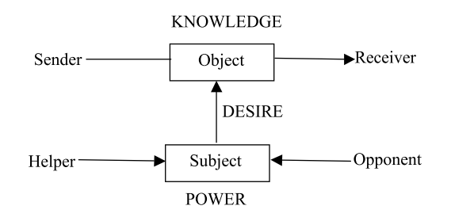

## Actantial model - Greimas

**RELATED TERMS: [Actant](https://github.com/narrative-environments/CourseCompendium/blob/main/Actant.md); [Actantiality](https://github.com/narrative-environments/CourseCompendium/blob/main/Actantiality.md); [Actor-Network Theory](https://narrative-environments.github.io/CourseCompendium/Actor-Network-Theory.html); Human actantiality**

Joanna Kwiat (2008: 43) suggests that the actantial model of narrative structure proposed by Greimas (1983) drew on at least four theories: Levi-Strauss’ theory of opposition, which states that a given concept A is impossible to comprehend without the equal and opposite concept Not A, and how A necessarily entails Not A, and thereby every possibility between; the syntactical functioning of discourse; the inventory of actants proposed by Vladimir Propp, which he called “dramatis personae”; and the inventory of actants proposed by Etienne Souriau, which he referred to as “dramaturgic functions”.

As Kwiat explains, in Greimas’ actantial model, there are six actants that form three pairs or oppositions: subject vs. object, sender vs. receiver and helper vs. opponent. These oppositions generate three types of relations: desire, which is felt by the subject for the object; knowledge, constituted by communication between sender and receiver; and power, realised through the agonistic struggle between helper and opponent (in relation to subject vs. object and sender vs. receiver).

These actants may combine. For example, there can be a duality of roles, in which one desires something in and receives something from the other who sends. Helper and Opponent may similarly combine with Subject, being at once the (conscious) will yet also the the (unconscious) resistance to act in fulfilling desire.

Conversely, a single actant may be instantiated with more than one actor, e.g. a multiplicity of helpers.

Propp had studied Russian folktales and described their constituent functions. After studying the relationships of these functions and the characters to which they were attributed, he defined certain spheres of action and seven characters to which these spheres corresponded. For Propp, the inventory of the functions could be reduced to 31 functions that had to be in a sequential order.  Greimas saw that, with a structuralist approach, these functions and characters could be still much more reduced and freed from the sequential constraint. He accomplished this in his first book, _Structural Semantics_ (Peisa, 2008).

Greimas first turned to the seven characters, which he reformulated as the three opposing actant-pairs: subject versus object; sender versus receiver; and, more hesitantly, helper versus opponent. The defining relation between subject and object was desire that could be manifested as the subject’s quest for the object. The sender’s and the receiver’s relation was that of communication. The helper and opponent again appeared to Greimas more as circumstants (circumstantial features of the action) that, as partial formulations of the subject, affect his abilities (Peisa, 2008)

A strategic consideration was that these actants were not necessarily tied to a single representative character in the narrative. Based on Propp’s material Greimas then constructed a model, depicted in the diagram below, where the object of the subject’s desire is also the object of communication. This is the form in which the actantial model has usually come to be known although, as Peisa (2008) notes, Greimas himself has rarely referred to it in this particular graphic form.

The actantial model first appeared in its canonical form in 1966 in A. J. Greimas’s _Semantique structurale_ (_Structural Semantics_). It was later refined by Greimas in his 1973 essay on “Actants, Actors, and Figures”. The model was widely influential, adopted and adapted in much subsequent narratological work.

**References**

Greimas, A. J. (1983). _Structural Semantics: An Attempt at a Method_. Lincoln: University of Nebraska Press.

Herman, D. (2000). Existentialist Roots of Narrative Actants. _Studies in Twentieth Century Literature_, 24 (2), 257–270\. Available from https://newprairiepress.org/sttcl/vol24/iss2/5/ [Accessed 17 November 2018].

Kwiat, J. (2008). _From Aristotle to Gabriel: a summary of the narratology literature for story technologies_. Technical Report, KMI-08-01\. Milton Keynes: Knowledge Media Institute, Open University, Available from http://kmi.open.ac.uk/publications/pdf/kmi-08-01.pdf [Accessed 8 October 2015].

Peisa, J. (2008). _The Unable individual. The actantial analyses of three Chinese films and discussion on their representations of the individual’s position in contemporary Chinese society_ [Master’s thesis]. University of Helsinki. Available from https://helda.helsinki.fi/handle/10138/19218 [Accessed 12 September 2015].

**How to cite this entry, using an author-date system:**

Parsons, A. (2021). Actantial model - Greimas. _MANE Compendium_. Available at https://narrative-environments.github.io/CourseCompendium/Actantial-Model-Greimas.html [Accessed Day Month Year].

**Further Reading**

If you are interested in pursuing further research into A. J. Greimas and his work in semantics, semiotics and narratology, it is worth having a look at _Sign Systems Studies_, Vol 45, No 1/2 (2017): Special issue: A. J. Greimas – a life in semiotics. It can be found at [http://www.sss.ut.ee/index.php/sss/](http://www.sss.ut.ee/index.php/sss/)
