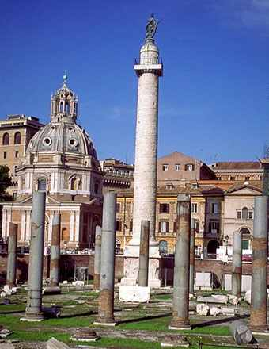

## Awestruck

Cast of Trajan Column, V&A Cast Court, London

The question posed by the following narration is:’Is there a risk of the content neutralising the narrator or author’s voice?’

“On a recent late night visit to the V&A I stumbled upon a room I had never seen before, this being quite ironic as the space houses one of the largest objects in the museum’s collection. From the elevated viewing point of the first floor I looked down on the expansive Cast Court filled with a weird and wonderful collection of sculptures, works of art and architectural details from all around the globe.  
I was enthralled by the sheer scale of the Trajan Column, so large it was in two parts and still hunched under the ceiling of the building. I quickly made my way down to the ground floor to take a better look.

I was delighted to learn these were casts not artefacts plundered from their original context. I was in awe of the scale and talent on display through these reproductions and enjoyed flitting countries and centuries admiring an 8th Irish High Crosses alongside 15th Baptistery doors from an Italian Church, caskets in memorandum of distinguihed fallen heros next spirited public sculptures.

Close up on the detail of the Trajan Column

Was this space however a narrative environment? Certainly the pieces themselves had stories to tell, in fact many were produced for just this reason when literacy would have been an issue but was there a common thread pulling the space together? Or can there be a display of this magnitude without a story being told? Was the narrative purposely played down so the content would shine or was there no need for narrative when the individual stories were so strong? I have my views but I guess this is the debate I now open up…”

Completed in 113AD the original Trajan Column can be found in Rome

