## Brion Vega Tomb - Tomba Brion

**RELATED TERMS: Architecture, Sound art; Agency; Framing narrative**

Carlo Scarpa uses a combination of views, sometimes truncated, sometime including ‘borrowed landscapes’, of architectural forms and elements, of textures and surfaces, of changes in density and perspective, to create a poetic, non-verbal narrative that is made up not just of visual architectural form and material, but of sound and touch as well. 

As a framing narrative, Scarpa’s Brion Vega Tomb, uses landscaping to tell a framing story about the buildings it contains, within which spatial layout, acoustics, borrowed landscapes and soundscapes weave a story around the narrative of the key architectural moments.

A video tour by Erik Schmitt can be seen here: https://vimeo.com/104562873

Below is an account of a visit by the architect and sound artist Thomas Lindner:
_Thanks to Thomas Lindner (Listening Architects) for the text. Used with permission. Images from Flickr (Creative commons, used with permission)_

**A visit to Brion Vega cemetery.**

Entering the gate of the original village cemetery I follow a path covered with interlocking concrete blocks. As I will find out later, the pavement leading from the entry to Scarpa’s porch was changed long after the completion of the project. The original layout shows a simple pebble layer, which can be imagined as a much more stimulating experience. The crunching gravel would have dissolved the harsh, dumb clicking of the hard road surface into a softened wider spectrum of prickling frequencies.

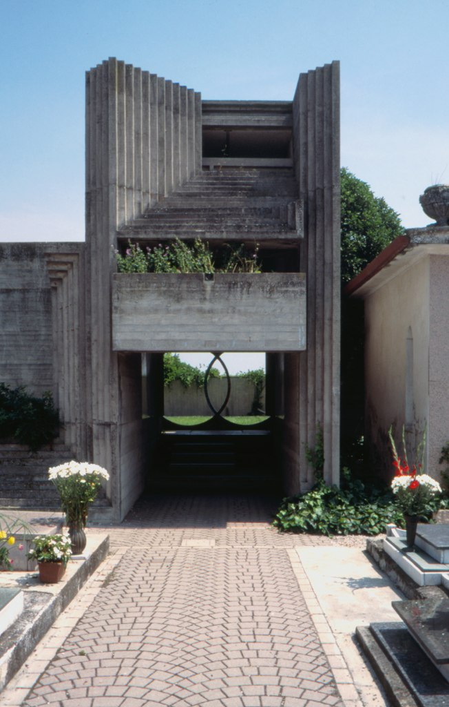

When entering what Scarpa called the propylaeum this effect must have been enormous as the almost double storey opening to the Brion complex amplifies the impression of entry by an immense hall effect reflecting from the two tall concrete walls and the high ceiling due to its hard, smooth surfaces. According to Scarpa, this effect underlines the significance of the gateway, introducing the spiritual “path as architects love pathways, [and] there are many, many pathways in Italy”.  
I walk up the three steps to the raised platform looking out on the garden, which can only be viewed through two large intersecting circles forming part of the cloister, which is positioned orthogonally to the incoming path.

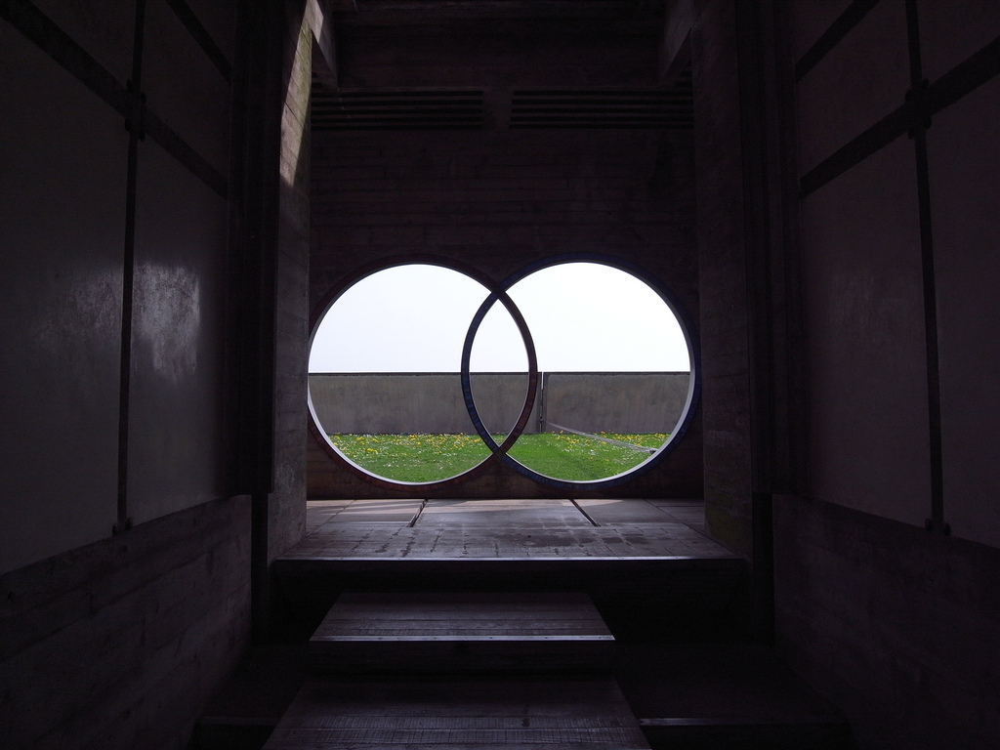

At this T-crossing the way is split in two and my first route takes me into the private part of the Cemetery called un pavilion pour la méditation.  
The space in the cloister is not even half the width of the propylaeum and on approaching another gate my shoulders are almost rubbing the adjacent walls. The ceiling height is also reduced and the sounds I emit are reflected instantaneously from the flanking walls and ceiling.

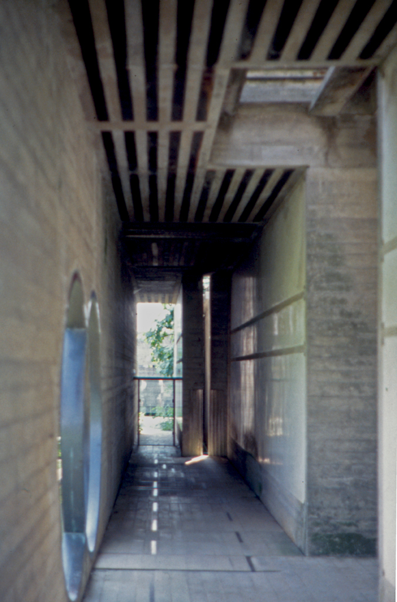

The cloister is paved with big concrete plates framed by steel, which are loosely positioned on their supports. When I step on them they resonate, tilt and clunk, further enhancing the feeling of narrowness. The impression of increasing claustrophobia comes to a halt in front of a type of door I have never seen before. It is made of a rectangular sheet of glass that is attached at the top to a stainless steel tube. The ends of the tube, which are fixed to steel cables leading upwards, guide the tube along a vertical indentation in the concrete wall. As the custodian explains, the glass flap must be pushed downwards to give access to the continuing path behind the glass screen. When opening it the squeaking mechanics of the counterweights, the scratching of the ends of the steel tube along the concrete groove in unison with the ephemeral sound of the glass plate first dipping, subsequently bubbling, into a shaft filled with water, transformed my perception of the gateway. Once over this threshold, the counterweights on the outside of the facade pull the door back into its original position. As Scarpa’s genius cut the sheet of glass 10 centimetres short at the bottom, the water on the glass accumulates at the bottom rim, trickles back into the slit of the floor and accompanies my further journey like a gentle xylophone playing for a little while.

I leave the cloister and step onto a footbridge, which seems to hover over a water surface under the open sky. Here to my surprise the concrete planks are fixed and do not tilt. The pond is flanked by three tall surrounding walls, which open up in the direction of the village.

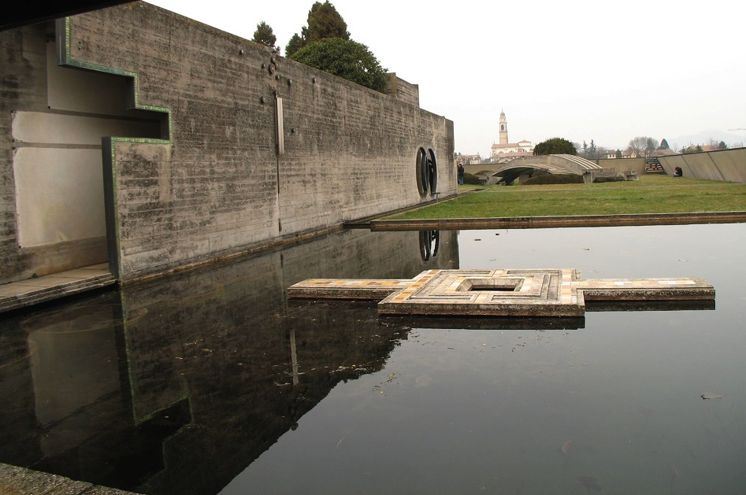

View of the village from the platform under the Meditation Pavilion_  
A becalming scenery is offered to the visitor, reminiscent of “borrowed landscapes” in Japanese garden design. Within this setting there is the quarter-hourly bell ringing of the church, whose tower can be seen on the horizon. Its ringing, which summons the inhabitants to gather together, connects the timelessness of the sacred cemetery area with the centre of the village.  
The occasional ringing of the bell is interspersed with the constant rhythm of the water dripping from the central drain located in the middle of the pond in front of the meditation pavilion.Here it is noteworthy that it is not the mere presence of water which contributes most to the restful meditative effect, but the particular sonic experience it offers. The “borrowed soundscape” from the village church (far) and the dripping water (close) are similar in volume and blend gently into one another.

The general architecture and the smooth water surface allows the tiniest sound to travel easily over long distances. The slightest utterance, generated either by myself, the drain, or little animals living in the pool is bounced over the smooth water surface like a flat pebble, thrown back by the smooth, upright walls and is gathered under the wooden hat of the pavilion, which covers the platform on which I sit. In this architectural setting even a single passing fly causes a sonic sensation.  
The way back leads through the cloister passage accompanied by the ritual performance of the glass-water-door which bids its dripping farewell. I pass the T-crossing and soon hear the whisper of grass under my feet.

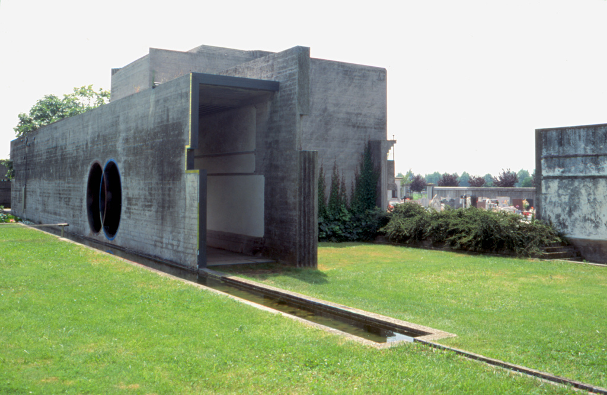

The garden reveals itself with its central arcosolium, a bridge covering two family tombs.

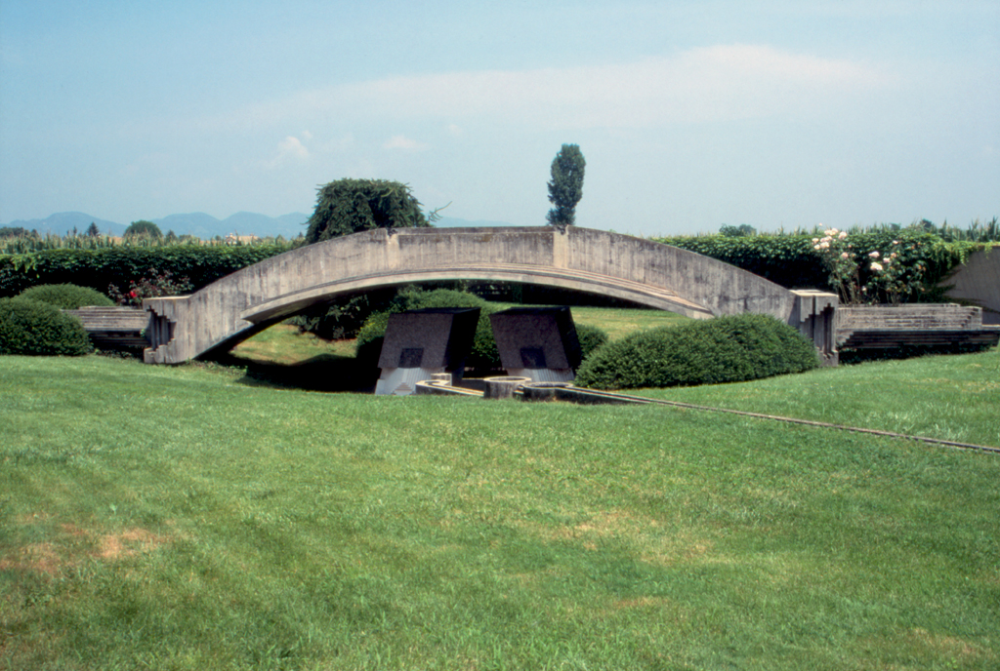

In front of the bridge there is a miniature well encased in a concrete vessel. Its bubbling water, which can scarcely be heard, flows gently along a little canal feeding the pond of the meditation pavilion.

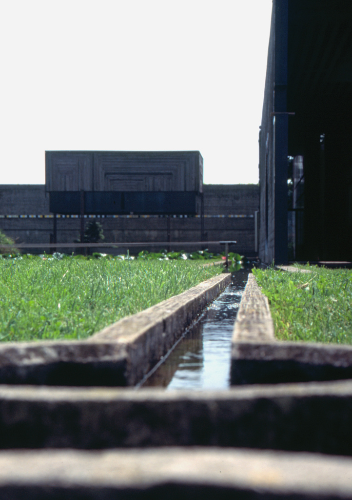

In the other direction it flows towards the tombs.

Apart from this all sounds are muffled by the grassy meadow, which does not allow much sound to travel.  
Most interesting of all, the surrounding walls of the outer L-shape in this part of the cemetery are inclined by 45 degrees.

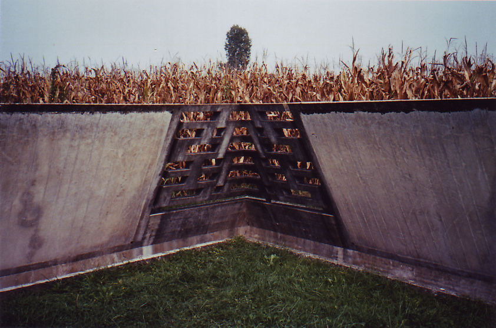

Unlike with the walls enclosing the pond, all the sounds in the garden, which are conducted through the air, are not reflected back on these leaning structures but straight into the ground, adding to the hush of the space.  
Leaving the quiet centrepiece of the arcosolium shading the two tombs and heading towards the second exit I descend from the raised gazon (lawn) on an inlet staircase.

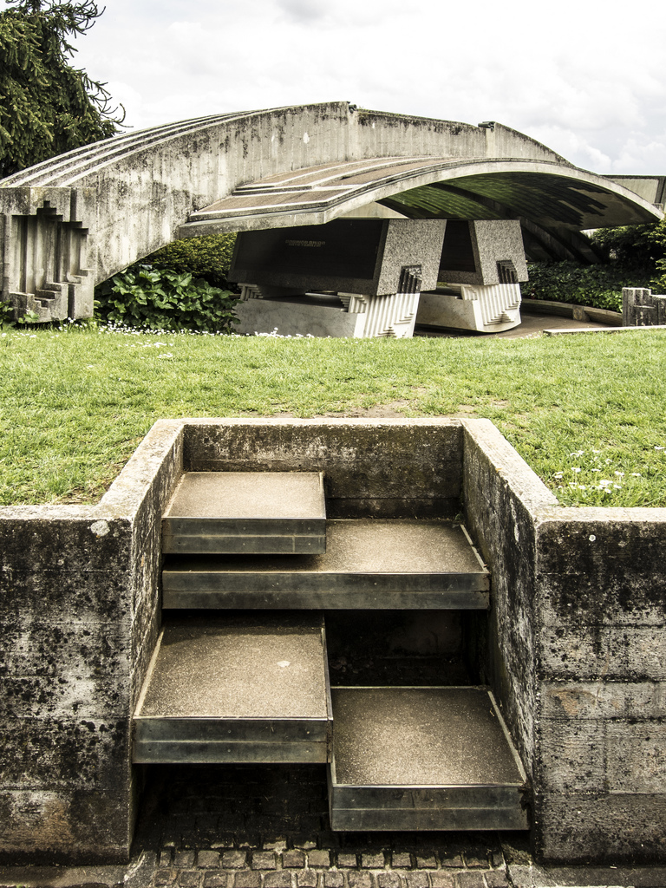

While stepping down I discover the inversion of a major chord. The unusually proportioned steps and odd arrangement suggest that Scarpa might have tuned his architecture.

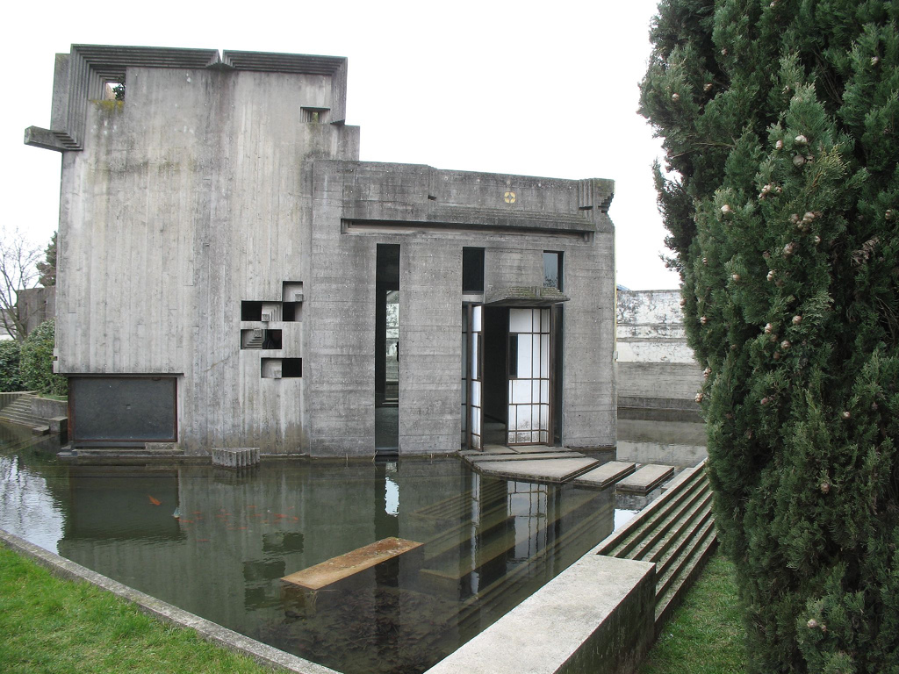

I reach the door into the Chapel across the water on some stepping stones. Turning the shrieking door handle, still outside, its reverberation suggests a vast internal cathedral space.  
Opening the door I encounter a humble chapel with fascinating shadows and light reflections, which bounce off the surface of the pool of water and stream through the slit windows splashing watery textures onto the bare concrete walls and the wood-panelled ceiling painted over in black. These moving spotlights are accompanied by indirect light, which enters through a reversed funnel hovering over the altar.

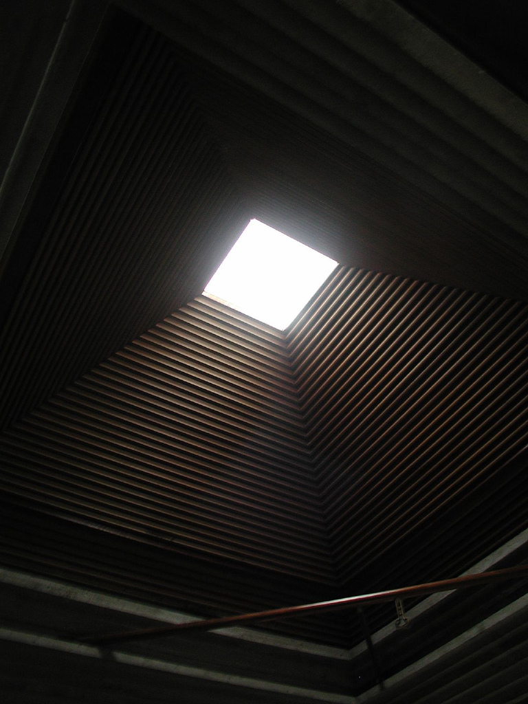

The holy-water font is covered with a movable lid. To open it I move a little lever.

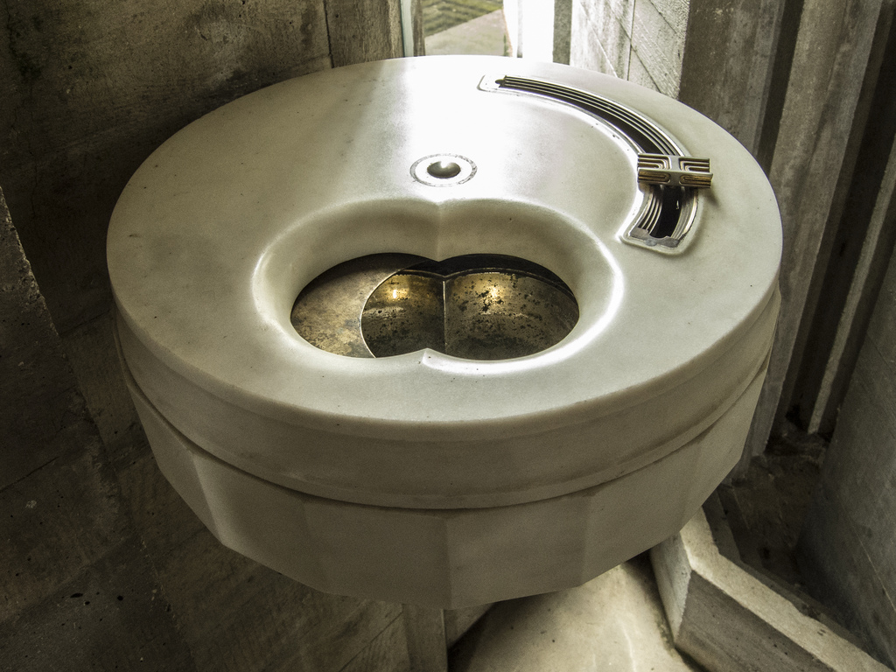

The incredible screeching noise fills the space again. The response of the space is extraordinary given its small dimensions.

Easier but no less impressive is the process of opening the two tall side doors, which are constructed of a steel frame filled with plaster blocks – an ancient Venetian technique rediscovered by Scarpa. The noise of the door hitting the stopper allows a further assessment of the spatial response. The sound is sonorous but brief and introduces the outside area, which is filled with cypresses.  

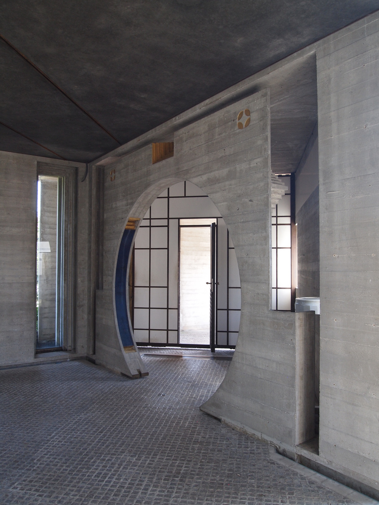

I would like to experience a funeral in this space because it was planned for communal use.  
During a service, while all the other doors are closed, two heavy gates can be opened at the back and bottom of the altar location. Due to their weight and width they generate a sonorous rubbing, which is released into a sounding vibration and disappears as soon the tiny sounds from the surrounding water surface are reflected into the reverberating space of the chapel.  

Leaving the chapel and finally approaching the second entrance I encounter a movable wall, made not of glass but of concrete, six centimetres in width, mounted on bearings. This gate stands open most of the time as the effort needed to open it is considerable. I open and close it about eight times before I leave the cemetery because the pleasure from its sound is mind-boggling and resists comparison with any other sound. It makes me imagine the sound that must have occurred when Jesus was resurrected and pushed the stone away from his tomb.

