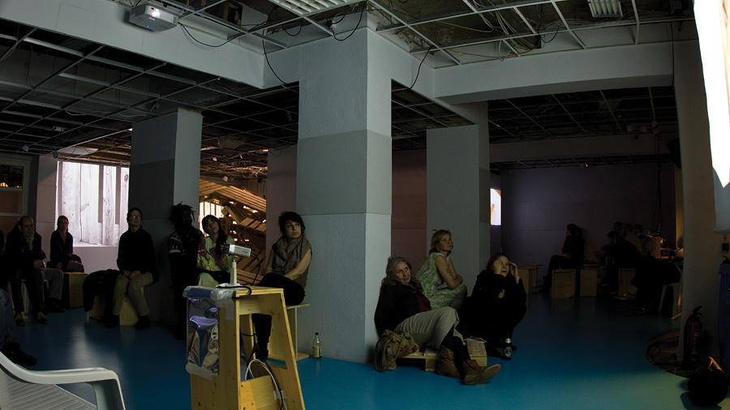
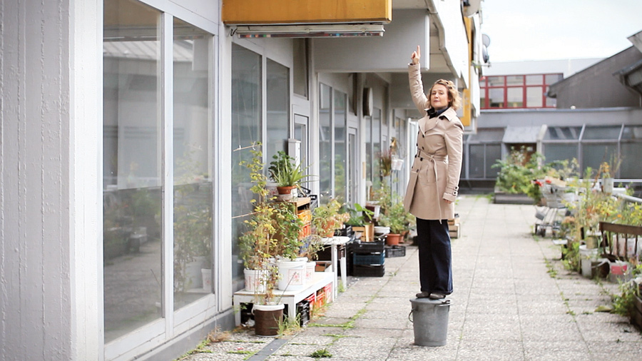
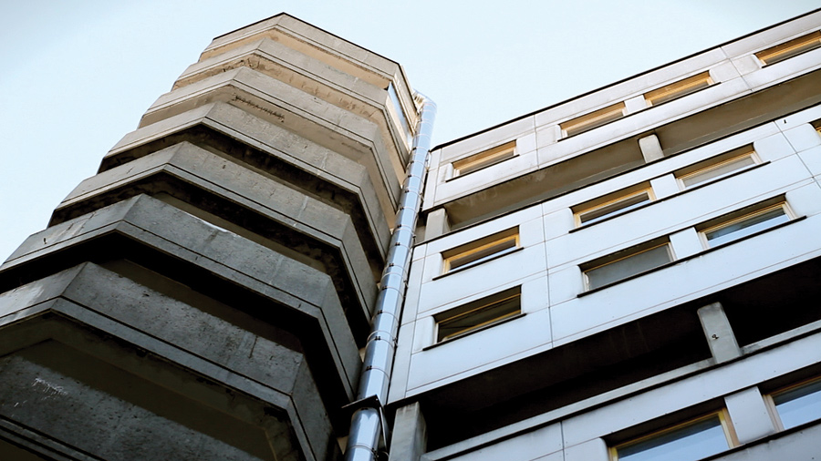
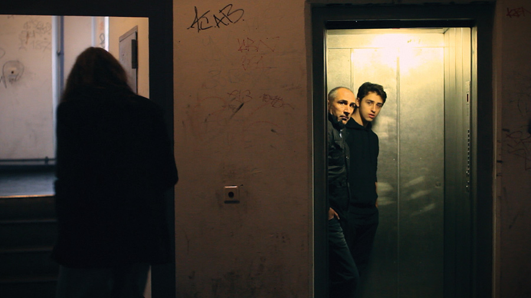
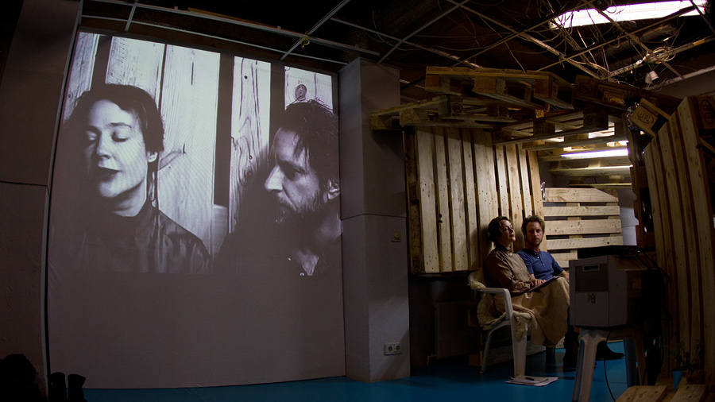

## DER BLOCK – this home was once a house

Contributed by by Lea Nagano

This project is an event involving video, guide tour, performance and a talk/discussion

The ‘Zentrum Kreuzberg’ at Kottbusser Tor in Berlin is a publicly debated residential building. Once planned as a metropolitan housing intervention in the urban heart of Berlin Kreuzberg, it ended up as a bank scandal, turning investors into debitors. Today it has become a building full of residents with multicultural backgrounds, drug dealers are bustling next to arabic shops and culinary restaurants… and even attracts young students and creatives. The performance and interactive event DER BLOCK is composed of three different parts. 

First the visitor is shown a documentary film about the building. It spots light from different perspectives with real and fictive interviews, of which the audience is not aware of. The film tells about memories, statements and insights of the building and of the city. 

After having watched this film, the audience is divided into two groups that have separate guided tours through the building. The audience now feels, smells and walks through the space, previously perceived by the documentary only. One group is guided by a Japanese woman speaking in Japanese, the other by a Kongo person, talking French, both have a German translator also. The actors tell and create their own narrative of the building to the group. This shows how the building has become the home and landscape of identity for different people. They do this by making multiple connections between their own culture, history, fiction and facts. 

After the guided tour the audience is watching a performance that throws them back to the 60s – the golden age of depreciation and subvention policies in Berlin. It is not a mere performance play. Instead it is interrupted by the audience being actively engaged into a conversation and discussion about critique of the privatisation and other housing issues in Berlin. Still there are situations when there is the traditional way of theatre performance. The actors tell personal stories of characters that really existed.

Reality and fiction are mixed and the whole building is reinvented as a place of secrets and utopias. The audience experiences the building through different tellings (film, performance, discussion, walking) and also mentally start to connect information, linking thoughts and images together.

The audience is in the middle of the happenings and senses time travel and personal narratives.

Documentation of the project can be found at https://vimeo.com/84369555

Website: http://www.viertewelt.de/archiv/2013/der_block.html

