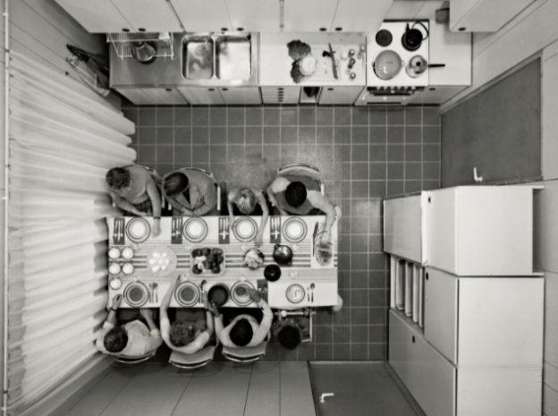

## Disciplinary societies and Societies of control

**RELATED TERMS: Affordances; Apparatus - Dispositif; Body; Biopolitics and Biopower**

A narrative environment could be said to form a kind of territory with its own characteristic laws, rules and regulations, a kind of ‘world’ or ‘universe’. In order to develop a sense of how such narrative environment enclosures might operate, how power is realised and distributed within them and how they, in turn, relate to their environments (i.e. of other narrative environments), it is worth considering the thoughts of Michel Foucault on disciplinary societies and Gilles Deleuze on societies of control.

The disciplinary societies, as defined by Foucault, are in the process of becoming societies of control, as defined by Deleuze, Chantal Mouffe (2012: 23) contends. This transition, which does not necessarily imply a complete replacement or displacement, is marked by the emergence of a new paradigm of power. In the disciplinary societies, command is exercised through the articulation of a network of apparatuses (dispositifs) that produce, and regulate customs, habits and practices of production, the major disciplinary institutions being the family, school, factories, asylums and hospitals. In societies of control, however, command is immanent to the social field, distributed to the minds and bodies of the citizens.

The means of social integration and exclusion are no longer realised primarily as enclosures (spatialised, territorialised, exteriorised) but through perception (interiorised, cognitive) that guides and is woven into embodied inter-action, as the environment is scoured for opportunities and affordances, for permissions and interdictions. This new paradigm of power is termed ‘biopolitical’. Looking at this transition from the perspective of spatial practices, however, it might be seen as a re-articulation of enclosure and perception, with people ‘enclosing’ themselves through their own perceptual and behavioural habits in a terrain that appears more ‘open’, ‘public’ or ‘common’ but nevertheless remains ‘enclosed’.

As outlined by Deleuze (1992: 3), Foucault defined _disciplinary societies_ as those which arose during the 18th and 19th centuries in Europe and reached their peak at the outset of the 20th. Such societies inaugurate and develop the organization of vast spaces of enclosure, in which the individual passes sequentially from one closed environment to another, each having its own laws. The first (narrative) environment is that of the family. From there, the individual passes on to the school and after that, if a man at that time, to the barracks. The passage continues to the factory and, on occasion, the hospital, and possibly the prison, this last place being preeminent instance of the enclosed (narrative) environment. For Foucault, the prison serves as the central analogical model.

The ideal project of these environments of enclosure, as analysed by Foucault, is particularly visible within the factory. It seeks to concentrate in place; to distribute in space; to order in time; and to compose a productive force within the dimension of space-time whose effect will be greater than the sum of its component forces. Foucault also recognised the transience of this model, as itself a successor to the _societies of sovereignty._ The goal and functions of _societies of sovereignty_ were to tax rather than to organise production and to rule on death rather than to administer life. This prior transition took place over time, with Napoleon seeming to effect the large-scale conversion from one kind of society to the other. However, in their turn, the disciplines underwent a crisis to the benefit of new forces that were gradually instituted and which accelerated after World War II: a disciplinary society had ceased to be dominant.

In Foucault’s (1980: 58) words,

“From the eighteenth to the early twentieth century I think it was believed that the investment of the body by power had to be heavy, ponderous, meticulous and constant. Hence those formidable disciplinary regimes in the schools, hospitals, barracks, factories, cities, lodgings, families. And then, starting in the 1960s, it began to be realised that such a cumbersome form of power was no longer as indispensable as had been thought and that industrial societies could content themselves with a much looser form of power over the body.”

Deleuze (1992: 4) summarises the difference between enclosures and controls in the following terms: “Enclosures are _molds_, distinct castings, but controls are a _modulation_, like a self-deforming cast that will continuously change from one moment to the other … “

**References**

Deleuze, G. (1992). Postscript on the societies of control. _October_, 59 (1), 3–7\. Available from http://www.jstor.org/stable/778828 [Accessed 21 March 2016].

Foucault, M. (1980). Body/Power. In: _Power/Knowledge: selected interviews and other writings 1972-1977_, edited by C. Gordon. New York, NY: Pantheon Books, 55-62.

Mouffe, C. (2012). Space, hegemony and radical critique. In: Featherstone, D., and Painter, J., eds. _Spatial Politics: Essays for Doreen Massey_. Chichester, West Sussex, UK: Wiley-Blackwell, 19–31.

