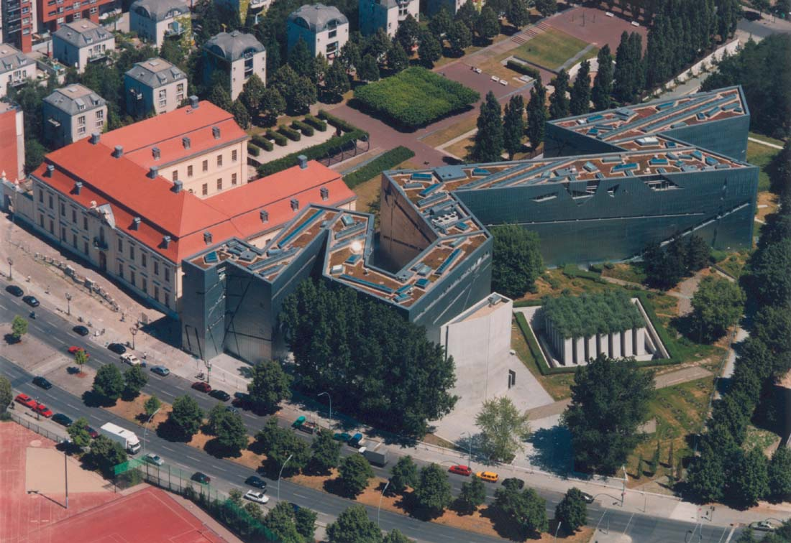
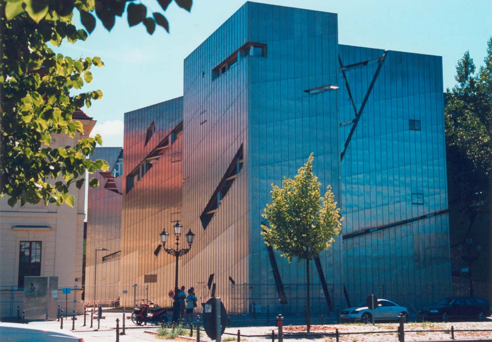
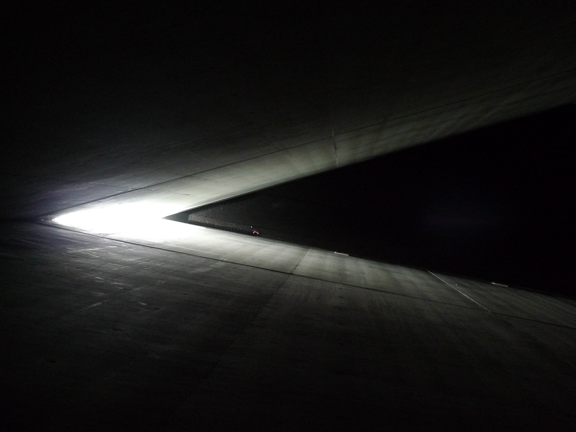
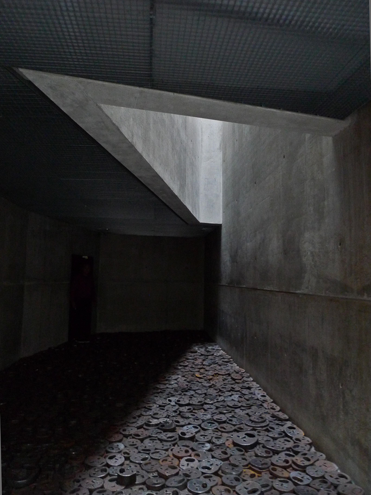
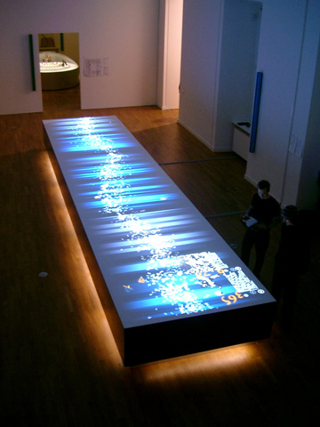

## Floating Numbers at the Jewish Museum Berlin 

RELATED TERMS: 

Floating Numbers at the Jewish Museum Berlin constitutes a set of nesting narratives. 

The museum building tells through its architecture a story of fragmentation and destruction. In particular, the bird’s eye view shows it as a broken and unravelled Star of David. 

The exterior looks as if it has been attacked and slashed 

 

even the memorial garden looks off kilter, and in winter, bleak 

The exterior forms a (somewhat overpowering!) framing narrative (in fact a meta-narrative) for the many narratives told in its interior. The interior is often bare, sometimes it looks abandoned 

 

sometimes the sense of being only inhabited by fragments and memories of pain is explicit and refers explicitly to the death camps 

 

On the other hand, the exhibition content is typically joyous and full of life. One particular exhibit uses narrative, symbolism and ritual to draw us into the arcance world of numerology, which is a very important part of both the Torah and the Kabbalah. You enter a room which contains a long table round which visitors stand. 

This evokes the Jewish traditon of eating together on every Shabat, and in particular at Pessach (Passover), when people stand to eat. Anyone who is Jewish or has watched Woody Allen films will know that jewish people love to talk during the meal, typically arguing, gossiping and telling each other stories. The table is covered with numbers instead of food 

 

as people reach for the numbers (food for the mind) 

the numbers open up and tell their story of their relationship to Jewish learning and culture. 

