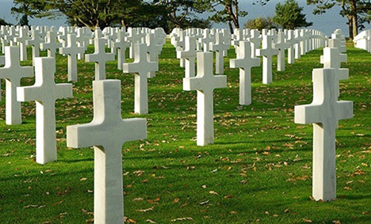

## Military Cemeteries

RELATED TERMS: 

Military cemeteries: a narrative environment, proposed by Natalia Filatova, November 2017

Military cemeteries can be seen as examples of narrative environments. There is a clear narrative about equality. All who perished were equal in their duty and equal in their death; and they are equal in their memory and honour. This story is realised by simple means. The gravestones look identical, with simple inscriptions of name, dates and rank.

The field is made to look like an ideal geometrical space with thousands white stones. As the visitors look at all these gravestones intently, they come to recognise a second narrative. The huge quantity of lost lives serves as a cautionary tale for current and future generations, causing them to pause before engaging in violent conflict.

All visitors of every military cemetery in any country could ‘read’ these two stories through the spatial practice.

Arlington National Cemetery

Normandy American Cemetery and Memorial

