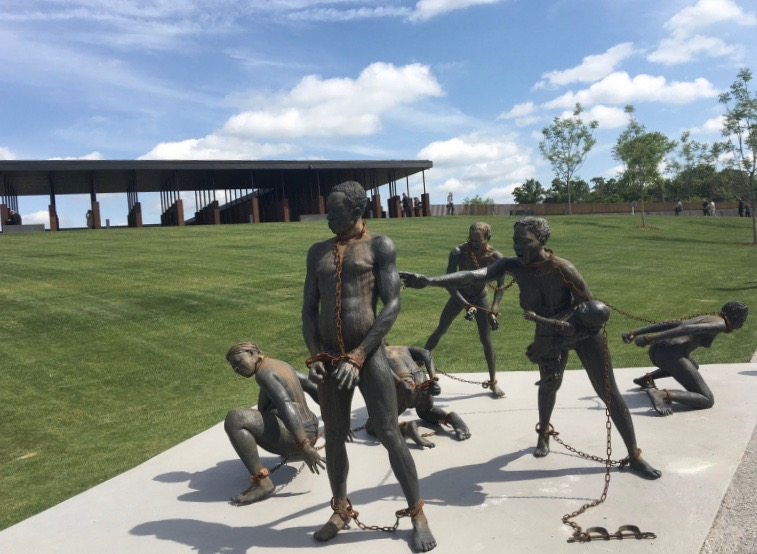

## National Memorial for Peace and Justice

RELATED TERMS: 

Photo: Marco Ramirez

As reported by Adina Solomon (2018), the National Memorial for Peace and Justice is located near the church where Martin Luther King served as pastor in Montgomery, Alabama, a city steeped in the US domestic slave trade. It is dedicated to remembering black victims of lynching in the USA and to developing public understanding of the systematic character of lynching. Lynching was designed to oppress people of colour economically, socially and politically. It led, as the Memorial explains, to mass migration, causing six million black people to leave the South in the period 1910-1970.

The Memorial is accompanied by the nearbyLegacy Museum which is dedicated to telling the history of slavery and racism in the USA. The Museum is housed on the site of a former warehouse where enslaved black people were imprisoned. The design of the site was undertaken by the MASS Design Group, and features the work of several artists: Kwame Akoto-Bamfo, Hank Willis Thomas and Dana King. The research and data gathering was undertaken by current and former staff of the Equal Justice Initiative.

Photo: Shawn Calhoun. Sculpture: Kwame Akoto-Bamfo

The stripped back design allows people to develop their own responses and understanding of slavery and lynching as they progress through the site, while the simplicity of its design evokes a sense of dignity for the victims.

The USA abolished slavery in 1865\. Nevertheless, the way of thinking that provoked lynchings persisted. Eight hundred corten steel monuments, one for every US county where a lynching took place, each bearing the respective victims names, are suspended from the roof structure in the memorial square, a minimal peristyle-like structure, evoking the vestigial sense of hanged bodies.

The visitor, on entering the building, meets the monuments at eye level but is gradually led by the sloping floor to a position under the hanging monuments.

Photo Marco Ramirez

One side of the memorial square has epitaphs on the wall with victims’ names and the reasons for their hangings, such as eloping with a white woman and standing around in a white neighbourhood. The final side of the square on the visitor’s journey has a wall with water streaming down it, generating a peaceful sound while also evoking the tears of bygone generations of black people.

The memorial in Montgomery takes its influences from other such memorials around the world: the Kigali Genocide Memorial centre in Rwanda; the Memorial to the Murdered Jews of Europe in Berlin; and the Apartheid Museum in Johannesburg.

**References**

EJI (2017). National Memorial for Peace and Justice. _Equal Justice Initiative_ [Website]. [https://eji.org/national-lynching-memorial](https://eji.org/national-lynching-memorial) [Accessed on 6 October 2018]

Solomon, A. (2018). Writing wrongs. _Blueprint_, 360, pp.166-176.

