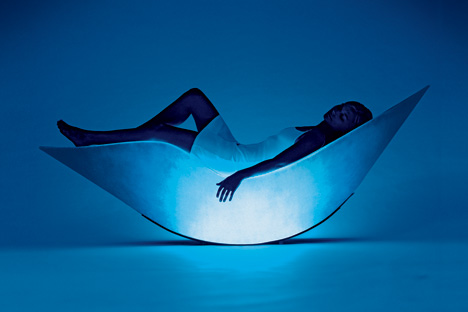
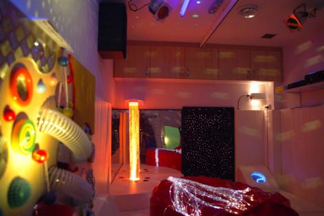

## Sensory Design

**RELATED TERMS:**

Nathan Shedroff defines sensory design as the employment of all techniques with which we communicate to others through our senses. 

Writing, visual design techniques in disciplines such as graphic design, videography, cinematography, typography, illustration, and photography are usually the first to be recognized and employed. 

However, the disciplines that communicate through other senses are equally important. Sound design and engineering or musical and vocal performance, for example, are also useful in the appropriate circumstances and sometimes may be the only appropriate media for communicating a particular message. Tactile, olfactory, and kinesthetic senses are rarely employed, due to technological or market constraints, but are just as valid and can add enriching detail to an experience.

**References**

Shedroff, N. (2000) ‘Information interaction design: a unified field theory of design’, in Jacobson, B. (ed.) _Interaction design_. Cambridge, MA: MIT Press, pp. 267–292.

## Multisensory Design

Lascaux IV Cave Painting Centre (Casson Mann and Snøhetta)

Multi sensory design is not clearly identified as a separate practice, more as an approach to design, or a design solution, in various practices, in particular industrial and product design,

Alphasphere by artist and perception researcher, sha,

and in spatial design.

St Oswald’s Children’s Hospice – Multi-sensory room. By Jane Darbyshire and David Kendall Architects.

Multi sensory design solutions are often used in narrative environments, most frequently using sight, hearing and touch, but also sometimes taste and smell as well. A good example is Jelly Deng’s (graduated 2015) ‘Whispery Savoury’ which engaged all five senses but most notably combined eating with sound which involved a performative element.

**Links**

Whispery Savoury by Jialin (Jelly) Deng: <https://player.vimeo.com/video/131707411>

Although it is not clearly delineated as an independent practice, multi sensory design is much practised and written about:

<https://www.researchgate.net/profile/Rick_Schifferstein/publication/254004026_Multi_sensory_design/links/00b4952961608f23a7000000.pdf>

<http://www.wikid.eu/index.php/Multi-sensory_design>

<http://www.psy.ox.ac.uk/>

More on the Lascaux Caves project

<http://snohetta.com/project/63-centre-international-d-art-parietal-montignac-lascaux-lascaux-iv-caves-museum>

<http://www.dezeen.com/2013/02/28/lascaux-iv-international-cave-painting-centre-by-snohetta-duncan-lewis-and-casson-mann/>

